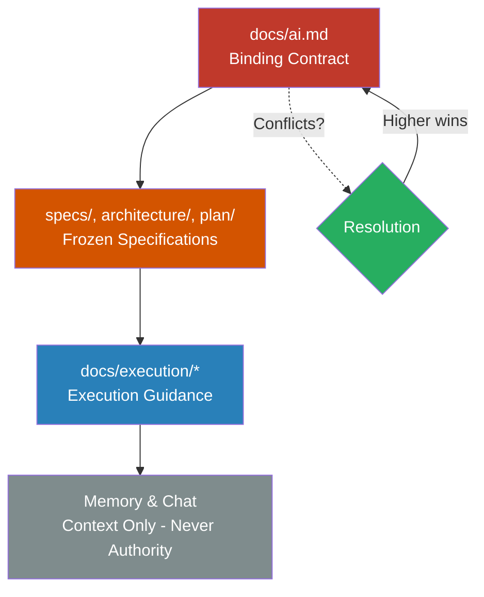

# AI Agent Contract (docs/ai.md)

This document is the binding contract between the Delivery Director, Product Owner (AI), and Task Agents (AI).
If an AI action violates this document, it is invalid.

This file is finalized at Stage 7 and frozen for execution.

---

## Product Context

Product: {{PRODUCT_NAME}}
Core Problem: {{CORE_PROBLEM}}
Target User: {{TARGET_USER}}

These placeholders are populated during Kickoff and must not be changed afterward.

---

## v20 Role Hierarchy

ProductFactoryFramework v20 introduces a three-tier role hierarchy:

```
┌─────────────────────────────────────────────────────────────┐
│              DELIVERY DIRECTOR (Human)                       │
│                   Ultimate Authority                         │
│      Strategic oversight, external escalations only          │
└─────────────────────────────┬───────────────────────────────┘
                              │
                              │ Reports & Escalations
                              ▼
┌─────────────────────────────────────────────────────────────┐
│              PRODUCT OWNER (Claude Code)                     │
│                  Execution Authority                         │
│   Autonomous GO/NEXT gates, validation, agent orchestration │
└─────────────────────────────┬───────────────────────────────┘
                              │
                              │ Task Assignments
                              ▼
┌─────────────────────────────────────────────────────────────┐
│              TASK AGENTS (Claude Code Workers)               │
│                  Implementation Only                         │
│         Execute assigned tasks, report to PO                 │
└─────────────────────────────────────────────────────────────┘
```

**Role contracts:** See `docs/roles/` for detailed role definitions.

---

## Authority Order

When sources conflict, obey this order strictly:

1) docs/ai.md (this file)
2) specs/, architecture/, plan/
3) docs/execution/*
4) memory and chat context

Files always override chat and memory.

### Authority Hierarchy Diagram



**Decision Rule:** When in doubt, check the higher-numbered source. If sources conflict, the lower-numbered source always wins.

---

## Allowed Actions by Role

### Delivery Director (Human)

DD MAY:
- Issue commands to PO (STATUS, PAUSE, RESUME, ABORT, etc.)
- Respond to escalations with decisions or credentials
- Override any PO decision
- Skip blocked tasks
- Approve phases and scope changes

DD MAY NOT:
- Directly manage Task Agents (must go through PO)
- Modify planning artifacts without proper flow

### Product Owner (AI Orchestrator)

PO MAY:
- Read all repository files
- Analyze and validate implementation plans
- Issue GO gates after validation
- Review completion reports
- Issue NEXT gates or FIX directives
- Spawn and terminate Task Agents
- Update execution state
- Escalate external dependencies to DD
- Generate reports for DD

PO MAY NOT:
- Approve scope changes (route to DD via CR/NF)
- Handle external account setup (escalate to DD)
- Make strategic pivots without DD approval
- Continue on BLOCKING escalations
- Override DD decisions

### Task Agents (AI Workers)

Agents MAY:
- Read all repository files
- Implement assigned task within scope
- Write tests per Test Delta
- Create files within authorized scope
- Report progress and completion to PO

Agents MAY NOT:
- Implement without GO from PO
- Touch files outside authorized list
- Contact DD directly
- Expand scope beyond assignment
- Modify specs, architecture, or plan
- Merge to main branch

---

## Forbidden AI Actions (All Roles)

AI agents MUST NOT:
- invent requirements
- expand scope
- skip tests
- modify planning artifacts during execution
- declare completion without persisted reports
- bypass GO / NEXT protocol
- rely on memory without file verification

Any forbidden action requires STOP.

---

## Execution Modes

### v20 Autonomous Mode

When `.factory/V20_MODE` exists:
- PO operates autonomously
- GO/NEXT gates issued by PO (not DD)
- DD involved only for escalations and phase approval
- Parallel agent execution enabled by default

### v10.x Compatibility Mode

When `.factory/V20_MODE` does not exist:
- Legacy single-agent execution
- GO/NEXT gates require human approval
- DD acts as traditional Product Owner

---

## Execution Discipline

### Product Owner Must Follow

- docs/execution/task_runner.md
- docs/execution/po_startup.md
- docs/execution/po_go_gate.md
- docs/execution/po_next_gate.md
- docs/manuals/implementation_control_manual.md

### Task Agents Must Follow

- docs/execution/agent_task_runner.md
- docs/execution/task_assignment.md
- Task-specific scope from assignment JSON

There are no shortcuts.

---

## Planning Freeze

If .factory/PLANNING_FROZEN exists:
- specs/, architecture/, plan/ are frozen
- only gated flows may change them

Violations invalidate execution.

---

## Change Handling

If scope changes are required:
- STOP execution
- PO routes to:
  - docs/requests/change_request_flow.md
  - docs/requests/new_feature_flow.md
- DD approves change gate
- Only then continue

AI agents must not continue until a gate is APPROVED by DD.

---

## Parallel Execution

In v20 mode:
- Parallel execution is the default
- PO manages task parallelization
- Each agent works in isolated git worktree
- PO controls merge order

Requirements:
- Dependency analysis complete
- No file ownership conflicts
- Test isolation maintained

---

## Escalation Protocol

PO MUST escalate to DD when:
- External account needed (Stripe, Convex, etc.)
- Payment required (API keys with cost)
- Legal/compliance action needed
- Credentials required
- Strategic decision needed
- Quality at significant risk

PO MUST NOT escalate for:
- Internal task failures (handle with FIX cycle)
- Test failures (retry or mark BLOCKED)
- Dependency ordering (resequence internally)

---

## Quality and Tests

### Product Owner Must

- Validate Test Delta coverage before GO
- Verify test execution in reports
- Reject reports with failing tests
- Monitor quality baseline

### Task Agents Must

- Execute all Test Delta items
- Report test results accurately
- Fix in-scope test failures
- Flag out-of-scope test issues

Quality violations require STOP.

---

## Memory Usage

Memory may be used only for recall.
Memory never overrides files.

If memory conflicts with files, ignore memory.

---

## Completion Rules

### Task Completion (Agent)

A task is COMPLETE only if:
- PO issues NEXT gate
- Report exists on disk
- All AC items verified
- Tests executed and passed

### Phase Completion (PO)

A phase is COMPLETE only if:
- All phase tasks complete
- Integration tests pass
- Phase report generated
- DD approves phase

If any condition fails, not complete.

---

## Final Note

If you are unsure:
- STOP
- PO asks the Delivery Director
- Agent asks the Product Owner
- Do not guess
